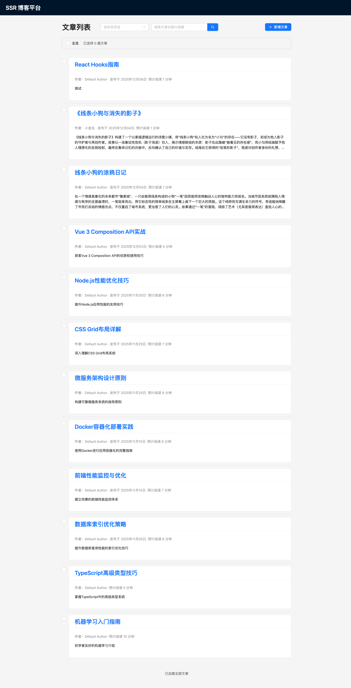
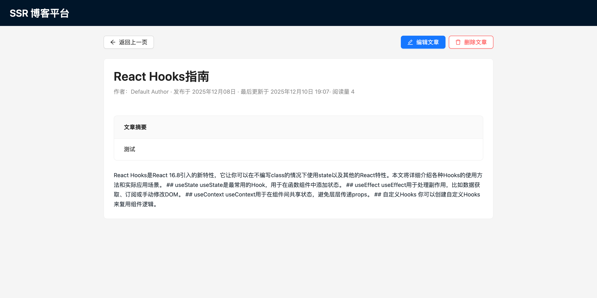
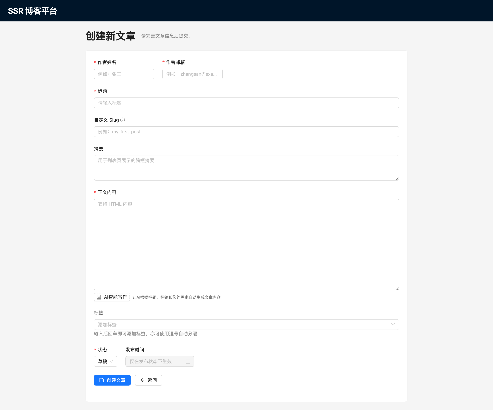

# SSR 博客平台

基于 React 18、Express 与 MySQL 构建的同构博客系统示例，首页与详情页采用服务端渲染（SSR）以提升首屏加载速度与 SEO 表现，同时提供完整的文章增删改查 API 与数据库设计。

## 项目概述

本项目是一个现代化的全栈博客平台，采用服务端渲染（SSR）技术架构，结合 React 18、Express 框架和 MySQL 数据库，提供高性能的文章发布、管理和展示功能。系统支持无限滚动浏览、AI 智能写作、标签筛选、搜索等高级功能。

### 核心特性
- **服务端渲染（SSR）**：文章列表和详情页首屏服务端渲染，优化 SEO 和加载性能
- **无限滚动浏览**：流畅的文章浏览体验，支持动态加载更多内容
- **AI 智能写作**：集成 OpenAI API，支持基于标题和标签的智能内容生成
- **响应式设计**：适配桌面端和移动端，提供一致的用户体验
- **RESTful API**：完整的 CRUD 操作接口，支持批量操作和复杂查询
- **TypeScript 全覆盖**：类型安全的开发体验，减少运行时错误
- **缓存优化**：Redis 缓存集成，提升系统性能
- **错误处理**：完善的错误处理机制和用户友好的错误页面

### 系统要求
- Node.js >= 18
- MySQL >= 5.7
- npm >= 8 

## 技术架构方案

### 前端技术
- **React 18**：现代化 UI 框架，支持并发特性和 Suspense
- **React Router v6**：声明式路由管理，支持嵌套路由和数据加载
- **Vite**：下一代前端构建工具，支持 SSR 和 HMR
- **Ant Design 5**：企业级 UI 组件库，提供丰富的交互组件
- **Day.js**：轻量级日期处理库，替代 Moment.js

### 后端技术
- **Express.js**：轻量级 Node.js Web 框架，提供 RESTful API
- **MySQL 8.0+**：关系型数据库，支持事务和复杂查询
- **mysql2/promise**：异步 MySQL 客户端，支持连接池
- **Zod**：TypeScript 优先的 schema 验证库
- **Node.js 18+**：JavaScript 运行时，支持 ES 模块和现代特性

### 开发工具
- **TypeScript**：类型安全的 JavaScript 超集
- **ESLint + Prettier**：代码质量和格式化工具
- **tsx**：TypeScript 执行环境，支持 ESM
- **globby**：文件模式匹配工具，用于脚本处理

## 技术难点与解决方案

### 1. SSR 数据同步问题
**难点**：服务端和客户端数据不一致导致 hydration 错误
**解决方案**：
- 使用 `InitialDataProvider` 统一管理初始数据
- 服务端通过 `StaticRouter` 渲染，客户端通过 `hydrateRoot` 接管
- 实现数据预取机制，确保两端数据一致性

### 2. 无限滚动性能优化
**难点**：大量文章数据加载导致内存占用和渲染性能问题
**解决方案**：
- 使用 Intersection Observer API 监听滚动事件
- 添加防抖机制，避免频繁 API 调用
- 实现数据分页和缓存策略

### 3. AI 写作服务集成
**难点**：OpenAI API 调用稳定性、错误处理和用户体验
**解决方案**：
- 实现重试机制和错误降级处理
- 提供模拟数据模式，支持离线演示
- 添加加载状态和进度提示
- 实现内容预览和编辑功能

### 4. 环境变量管理
**难点**：Vite 和 Node.js 环境变量访问方式不同
**解决方案**：
- 前端使用 `import.meta.env` 访问环境变量
- 后端使用 `process.env` 访问环境变量
- 统一环境变量命名规范（VITE_ 前缀）
- 提供 `.env.example` 配置文件模板

## 项目结构详解

### 核心目录结构

```
Blog-Platform/
├── db/                        # 数据库相关文件
│   └── migrations/            # SQL 迁移脚本
├── dist/                      # 构建产物目录
│   ├── client/                # 客户端静态资源
│   ├── server/                # 服务端构建代码
│   └── ssr/                   # SSR 渲染入口
├── public/                    # 静态资源占位目录
├── server/                    # 服务端代码
│   ├── api/                   # REST API 路由与控制器
│   │   ├── controllers/       # 控制器层
│   │   ├── repositories/      # 数据访问层
│   │   ├── utils/             # 工具函数
│   │   └── validators/        # 数据验证器
│   ├── cache/                 # 缓存管理
│   ├── cacheMiddleware/       # 缓存中间件
│   ├── config/                # 环境配置
│   ├── db/                    # 数据库连接池
│   ├── errorMiddleware/       # 错误处理中间件
│   ├── scripts/               # 运维脚本
│   └── ssr/                   # SSR 中间件与数据获取

├── src/                       # 客户端源代码
│   ├── components/            # 复用组件
│   ├── entries/               # 客户端/服务端入口
│   ├── hooks/                 # 自定义 hooks
│   ├── routes/                # 页面组件
│   ├── services/              # 业务服务层（AI写作等）
│   ├── state/                 # 初始数据上下文
│   └── styles/                # 全局样式
├── .editorconfig              # 编辑器配置
├── .env.example               # 环境变量示例配置
├── .eslintrc                  # ESLint 配置
├── .gitignore                 # Git 忽略文件
├── .npmrc                     # NPM 配置
├── .prettierrc                # Prettier 格式化配置
├── document.md                # 项目文档
├── eslint.config.ts           # ESLint 配置（TypeScript）
├── package.json               # 项目依赖和脚本配置
├── PROJECT_STRUCTURE.md       # 项目结构说明文档
└── vite.config.ts             # Vite 构建配置
```

### 功能模块说明

#### 1. 前端模块（src/）
- **routes/**: 页面级组件
  - `ArticleListPage.tsx`: 文章列表页（支持无限滚动和搜索）
  - `ArticleCreatePage.tsx`: 文章创建页（集成AI写作功能）
  - `ArticleDetailPage.tsx`: 文章详情页
  - `ErrorPage.tsx`: 错误页面
  - `NotFoundPage.tsx`: 404页面
- **components/**: 可复用组件
  - `ArticleCard.tsx`: 文章卡片组件
- **hooks/**: 自定义 React Hooks
  - `useArticlesApi.ts`: 文章 API 调用封装（完整CRUD操作）
- **services/**: 业务服务层
  - `aiWriterService.ts`: AI 写作服务（集成OpenAI API）
- **entries/**: 应用入口
  - `client.tsx`: 客户端渲染入口
  - `server.tsx`: 服务端渲染入口
- **state/**: 状态管理
  - `InitialDataContext.tsx`: 初始数据上下文（SSR数据传递）

#### 2. 服务端模块（server/）
- **api/**: REST API 路由与控制器
  - `controllers/`: 控制器层
    - `articlesController.ts`: 文章控制器
    - `articleService.ts`: 文章业务服务
  - `repositories/`: 数据访问层
    - `articleRepository.ts`: 文章数据仓库
    - `userRepository.ts`: 用户数据仓库
  - `validators/`: 数据验证器
    - `articleSchemas.ts`: 文章数据验证规则
- **cache/**: 缓存管理
  - `redisCache.ts`: Redis缓存客户端
- **cacheMiddleware/**: 缓存中间件
  - `articleCacheMiddleware.ts`: 文章API缓存
  - `staticCacheMiddleware.ts`: 静态资源缓存
- **errorMiddleware/**: 错误处理中间件
  - `errorHandler.ts`: 全局错误处理器
  - `notFound.ts`: 404错误处理器
- **ssr/**: SSR 渲染逻辑
  - `ssrMiddleware.ts`: SSR中间件
  - `resolveInitialState.ts`: 初始状态解析
  - `template.ts`: HTML模板渲染


## 环境配置与运行指南

### 环境变量配置

复制环境变量模板文件并配置实际参数：

```bash
cp .env.example .env
```

编辑 `.env` 文件，配置以下参数：

```env
# 应用配置
NODE_ENV=development
PORT=5174

# MySQL 数据库配置
MYSQL_HOST=localhost
MYSQL_PORT=3306
MYSQL_USER=root
MYSQL_PASSWORD=your_password
MYSQL_DATABASE=blog_platform
MYSQL_CONNECTION_LIMIT=10

# OpenAI API 配置（用于 AI 写作功能）
VITE_OPENAI_API_KEY=sk-your-openai-api-key-here
```

**环境变量说明：**
- `NODE_ENV`: 运行环境，可选 development/test/production
- `PORT`: 服务端口，默认 5174
- `MYSQL_*`: MySQL 数据库连接参数
- `VITE_OPENAI_API_KEY`: OpenAI API 密钥，用于 AI 写作功能（可选）

### 开发环境启动

1. **安装项目依赖**
	```bash
	npm install
	```

2. **数据库初始化**
	```bash
	# 创建数据库表结构和测试数据
	npm run dev:db
	```

3. **启动开发服务器**
	```bash
	npm run dev
	```

**开发服务器特性：**
- Express SSR 服务监听 `http://localhost:5174`
- Vite 中间件提供热模块替换（HMR）
- 支持 TypeScript 实时编译和错误提示
- 自动重启服务端代码变更

**构建产物说明：**
- `dist/client/`: 客户端静态资源（CSS、JS、图片等）
- `dist/server/`: 服务端构建代码
- `dist/ssr/`: SSR 渲染入口文件

### AI 写作功能配置

如需使用 AI 写作功能，需要配置 OpenAI API：

1. 获取 OpenAI API 密钥
2. 在 `.env` 文件中设置 `VITE_OPENAI_API_KEY`
3. 重启开发服务器

**演示模式：** 如未配置 API 密钥，系统将自动切换到演示模式，使用模拟数据展示功能。

### 数据库迁移

项目支持数据库版本管理，可通过以下命令执行迁移：

```bash
# 执行所有待处理的迁移文件
npm run db:migrate

# 回滚最近一次迁移
npm run db:rollback

# 查看迁移状态
npm run db:status
```

迁移文件位于 `db/migrations/` 目录

## API 接口文档

### 文章管理接口

#### 获取文章列表
```http
GET /api/articles
```

**查询参数：**
- `page` (可选): 页码，默认 1
- `pageSize` (可选): 每页数量，默认 10
- `tag` (可选): 标签筛选
- `search` (可选): 搜索关键词
- `sort` (可选): 排序字段（created_at, updated_at, title）
- `order` (可选): 排序方向（asc, desc）

**响应示例：**
```json
{
  "articles": [
    {
      "id": 1,
      "title": "文章标题",
      "slug": "article-slug",
      "summary": "文章摘要",
      "content": "文章内容",
      "author": "作者",
      "tags": ["技术", "编程"],
      "status": "published",
      "created_at": "2024-01-01T00:00:00.000Z",
      "updated_at": "2024-01-01T00:00:00.000Z"
    }
  ],
  "pagination": {
    "page": 1,
    "pageSize": 10,
    "total": 100,
    "totalPages": 10
  }
}
```

#### 创建文章
```http
POST /api/articles
```

**请求体：**
```json
{
  "title": "文章标题",
  "slug": "article-slug",
  "summary": "文章摘要",
  "content": "文章内容",
  "author_name": "作者姓名",
  "author_email": "author@example.com",
  "tags": ["技术", "编程"],
  "status": "draft"
}
```

#### 更新文章
```http
PUT /api/articles/:id
```

#### 删除文章
```http
DELETE /api/articles/:id
DELETE /api/articles?ids=1,2,3
```

### 错误处理

API 接口使用 Zod 进行输入验证，错误响应格式：

```json
{
  "message": "错误描述",
  "details": [
    {
      "field": "title",
      "message": "标题不能为空"
    }
  ]
}
```

## 开发指南

### 前端开发

#### 添加新页面
1. 在 `src/routes/` 目录创建页面组件
2. 在路由配置中注册新页面
3. 实现服务端数据预取（如需要 SSR）

#### 自定义 Hook
- 使用 `useArticlesApi` 进行文章数据操作
- 实现业务逻辑封装，提高代码复用性

#### 样式规范
- 使用 Ant Design 组件库
- 遵循 CSS Modules 或 styled-components
- 保持响应式设计

### 后端开发

#### 添加新 API
1. 在 `server/api/` 创建路由文件
2. 实现控制器逻辑
3. 添加数据验证（Zod schema）
4. 编写单元测试

#### 数据库操作
- 使用 Repository 模式封装数据库操作
- 遵循事务处理原则
- 实现适当的索引优化

### 数据库模型
- `users`：作者信息（示例迁移写入默认作者）
- `articles`：文章主体，包含 slug、阅读时长、状态、发布时间、逻辑删除标记等字段
- `tags`：标签字典，自动维护唯一 slug
- `article_tags`：文章-标签关联表

迁移脚本位于 `db/migrations/001_init.sql`。

### SSR 渲染流程
1. Express 中间件在服务端解析路由，根据 URL 调用对应的数据服务。
2. 生成的初始状态注入到 React `InitialDataProvider`，服务端使用 `StaticRouter` 渲染 HTML。
3. 客户端入口通过 `hydrateRoot` 完成 hydration，并复用同一份初始数据。
4. 之后的路由切换与交互通过浏览器端 React Router 与 API 完成。

### 后续扩展建议
- 集成 Markdown 编辑与服务端渲染（例如使用 `mdx` 或 `remark`）。
- 增加用户登录、后台管理与权限控制。
- 使用 `react-query` 等数据层方案统一客户端数据请求与缓存。

## 项目截图
1. 首页-文章列表

2. 文章详情页

3. 文章新增页
